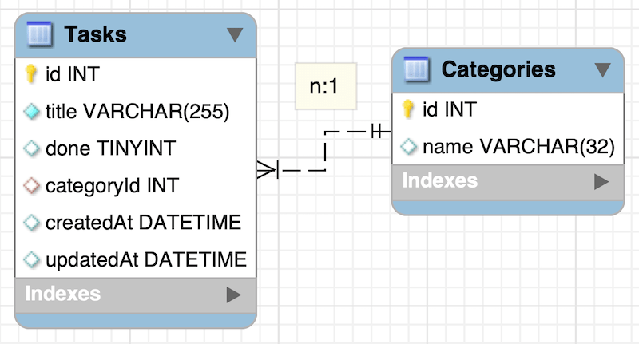

# Sequalize ToDo Sample

Node.jsの代表的なORMの一つである「[Sequalize](https://sequelize.org/master/)」を使ったToDoアプリのサンプルです。DBはMySQLを利用することを前提にしています。

Sequalizeの学習が目的のため実用性は考慮していません。

[](https://www.youtube.com/watch?v=dnDxIsu2l_8)
<small>※クリックでYouTubeへ移動します</small>

## Table of Contents
1. [Install](#install)
    1. [MySQL](#mysql)
    1. [git clone](#git-clone)
    1. [Node.js module](#nodejs-module)
    1. [config](#config)
    1. [migrate](#migrate)
1. [Execute](#execute)
1. [Licence](#licence)

## Install
### MySQL
実行したい環境に合わせてMySQLを準備してください。

* [MySQL Community Downloads](https://dev.mysql.com/downloads/mysql/)

### git clone
GitHubからcloneします。
```shellsession
$ git clone https://github.com/katsube/sequelize-todo.git
```

### Node.js module
[Node.js](https://nodejs.org/)をインストールし、npmコマンドで必要なモジュールを取得します。
```shellsession
$ cd sequelize-todo
$ npm install
```

### config
MySQLへの接続情報を以下のファイルに記述します。デフォルトはdevelopment環境になっているので、とりあえず動かしたい場合は一番上にある「development」にMySQLへのログインに必要な情報を記入します。
```shellsession
$ vi config/config.json
{
  "development": {
    "username": "root",
    "password": null,
    "database": "database_development",
    "host": "127.0.0.1",
    "dialect": "mysql"
  },
  "test": {
    "username": "root",
    "password": null,
    "database": "database_test",
    "host": "127.0.0.1",
    "dialect": "mysql"
  },
  "production": {
    "username": "root",
    "password": null,
    "database": "database_production",
    "host": "127.0.0.1",
    "dialect": "mysql"
  }
}
```

### Migrate
sequelize-cliを利用し、MySQLへ必要なテーブルを作成、初期データを追加します。
```shellsession
$ npx sequelize-cli db:migrate
$ npx sequelize-cli db:seed:all
```

以下の2つのテーブルが作成されます。



## Execute
以下のコマンドでWebサーバが3000番のポートで起動します。
```shellsession
$ node serve.js
listening at http://localhost:3000
```

Webブラウザから`http://localhost:3000`へアクセスするとToDoアプリを操作できます。

## Licence
MIT Licence